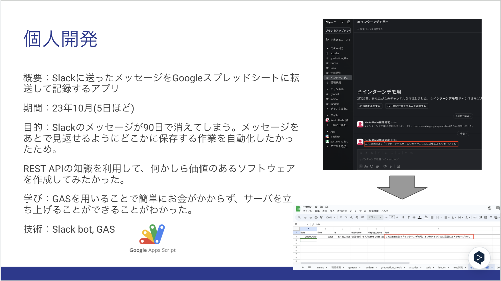

# アプリの概要
Slackのチャンネル投稿した内容が、自動的にGoogleスプレッドシートに保存されるようにするためのスクリプトです。
Slackをメモアプリのようにして使うことができます。

# なぜこのアプリを作成したのか
自分の調べたことや、自分の考えたことは、時間が経てば忘れてしまいます。
それらを思い出すのに私自身かなり時間を使ってしまっていました。
それらのことを手軽にメモできる場所が必要だと痛感していました。
チャットアプリのようなUIで、メモを送信してサーバに保存するアプリがあればいいなと思い、
Slackをメモのように使いたいと思いました。
ですが、Slackのフリープランだと60日経つと投稿が消えてしまいます。
これが、後から見返せると便利だと思い、Slackにメモを投稿したときに自動的に発火してGoogle Spread Sheetに保存されるようなスクリプトを作成しました。

# 技術選定
- Slack App
- GAS(Google Apps Script)
- Google Spread Sheet 

Slackを選んだのは私がSlackを頻繁に使うので、保存されるメモ機能が付いていたら便利だと思ったからです。
データの保存先としてDBでなくGoogle Spread Sheetを選んだのは、DBの使い方がわからない誰でもブラウザから簡単に保存した内容を一覧できるためです。

# Installation & Settings
以下を上から順に実行することでアプリの設定が完了します。
少し長いですが、初回だけなので頑張って実行してください。

## GAS(Google Apps Script)アプリのデプロイ
 
1. データの保存先となるGoogle Spread Sheetを作成します。
1. Google Spread Sheetの[拡張機能]>[Apps Script]を選択します。
1. 無題のプロジェクトのコードエディタが開くので、ここをreceive\_memo\_from\_slack.gsのコードの中身に置き換えます。
1. [デプロイ]>[新しいデプロイ]を押します。
1. [種類の選択]の横にある[⚙️]>[ウェブアプリ]を押します。
1. [新しい説明文]に自由に説明文を記入して、(例、「Slack Memo App V1」)、[次のユーザとして実行]を「自分」にして、[アクセスできるユーザ]を「全員」にします。その状態で、[デプロイ]を押します。
1. [アクセスを承認]を押します。
1. 自分のGoogleアカウントを選択します。
1. 左下の[Advanced]を押して、[Go to 無題のプロジェクト(unsafe)]を押します。無題のプロジェクトのところは人によって違う名前になっているかもしれません。
1. [Allow]を押します。
1. ウェブアプリのURLをメモしておきます。

## Slack ワークスペースの作成とSlack Appの作成

1. Slackでメモアプリのための新しいワークスペースを作成します. ワークスペース名は自由に決めます. 私は「Mymemo App」にしています.
1. [Slack Appのページ](https://api.slack.com/apps)から[Create New App]->[from scratch]を選択します。[App Name]は自由に決め、[Pick a workspace to develop your app in]は先ほど作成したワークスペースを選択します。
1. [Create App]を押します。

## Slack Appの設定(Bot User OAuth Tokenの発行)

3. 左のメニューから、[OAuth ＆ Permissions]を選択します。
4. [Scopes]の項目の[Bot Token Scopes]を見ます。([User Token Scopes]と間違えないようにします。)
5. [Add an OAuth Scope]を押して以下の権限を加えます。
	- channels:history
	- channels:join
	- channels:read
	- users:read
1. [OAuth ＆ Permissions]の[OAuth Tokens for Your Workspace]の項目にある[Install to Workspace]を押します。
1. [許可する]を選択します。
1.  [OAuth ＆ Permissions]の[OAuth Tokens for Your Workspace]の項目に[Bot User OAuth Token]ができるのでそれをメモしておきます。("xoxb-"から始まる文字列です。)

## Slack Appの設定(App ID, Verification Tokenの確認)

1. 左のメニューから、[Basic Infomation]を押して[App Credentials]の項目を見ます。
2. App IDとVerification Tokenをメモしておきます。

## GAS(Google Apps Script)のスクリプトプロパティの設定

3. GAS(Google Apps Script)のエディタの画面に戻り、左メニューの[⚙️]メニューを押します。
4. [スクリプトプロパティ]の項目の[スクリプトプロパティを編集]を押します。
5. これまでの操作でメモしていた値を使って以下の三つのスクリプトプロパティを以下のように設定し保存します。

| プロパティ名                                  | 値                                                     |
| :--------------------------------------------: | :------------------------------------------------: |
| SLACK\_APP\_ID                          | メモしておいたApp ID                         |
| SLACK\_VERIFICATION\_TOKEN   | メモしておいたVerification Token        |
| SLACK\_BOT\_USER\_TOKEN      | メモしておいたBot User OAuth Token |

## Slack AppでEvent Subscriptionの設定をします。
2. Slack Appのページのメニューから[Event Subscription]を選択します。
3. [Enable Events]をOnにします。
4. Request URLにGoogle Spread Sheetにデプロイした時にメモしたウェブアプリURLを入力します。verifyと表示されれば正しいです。Verifyとならない場合、以下を確認してください。
	- Google Apps Scriptのスクリプトプロパティで指定したVerification Tokenが正しいことを確認してください。
	- Google Apps Scriptで置き換えたコードが正しいことを確認して、デプロイし直してください。
5. [Subscribe to bot events]の項目で、"message.channels"のEventを追加します。
6. [Save Changes]を押します。

以上で設定は完了です。

# Usage
以下にSlackチャンネルに投稿したメッセージがGoogle Spread Sheetに保存されるように設定する方法を見ていきます。

1. Slack上で新しいチャンネルを作成します。
2. そのチャンネルに作成したSlack Appをインストールします。(インテグレーションの項目から追加できます。)
3. Google Spread SheetでSlackのチャンネル名と同名のシートを作成します。
4. Google Apps Scriptのエディタ画面を開いて、14行目のSHEET_NAMEの値を先ほど作ったSlackのチャンネル名にします。
5. Ctrl+Sで保存して、上のメニューの「(関数名)▼」の箇所から、[createFirstRow]を選択して、「▷実行」を押します。これにより、Google Spread Sheetの該当シートの一行目に新しい列インデックスの行が挿入されます。

以上を終えると、作成したSlackのチャンネルに投稿した内容がGoogle Spread Sheetに自動的に記述されるのが確認できると思います。同様の手順で複数のチャンネルを作成することができ、チャンネル名によりメモを分類するのに役に立ちます。(私は、卒論関連のメモはgraduate\_thesisチャンネル、Web開発関連のメモはweb\_developmentチャンネル、それ以外のメモはmemoチャンネルに投稿しています。)

